# SAP BTP Usage MCP Server

Talk to your SAP BTP costs using natural language! This MCP server lets AI assistants (like SAP Joule) answer questions about your cloud consumption.

**Examples of what you can ask:**
- *"How many cloud credits do we have left?"*
- *"Which services cost the most this month?"*
- *"Compare our spending: January vs February"*
- *"Are any services over their quota?"*

---

## Quick Start

```bash
# 1. Clone and enter the project
git clone https://github.com/ADS-Eng-TI-Cloud-Computing/sap-btp-usage-mcp-server.git
cd sap-btp-usage-mcp-server

# 2. Login to Cloud Foundry
cf login -a https://api.cf.<region>.hana.ondemand.com

# 3. Create required services
cf create-service xsuaa application sap-btp-usage-xsuaa -c xs-security.json
cf create-service destination lite sap-btp-usage-destination

# 4. Build and deploy
npm install && npm run build
cf push

# 5. Test it
curl https://<your-app-url>/health
```

Then configure the destinations in BTP Cockpit (see detailed steps below).

---

## How It Works (Simple Version)

```
┌──────────────┐         ┌──────────────┐         ┌──────────────┐
│   You ask    │   ───►  │  MCP Server  │   ───►  │  SAP BTP     │
│   Joule      │         │  (this app)  │         │  Usage API   │
└──────────────┘         └──────────────┘         └──────────────┘
     "How many               Validates              Returns real
   credits left?"            & fetches               usage data
```


**In plain English:**
1. You ask Joule a question about BTP costs
2. Joule calls this MCP server with your question
3. The MCP server fetches the data from SAP's Usage API
4. You get a natural language answer

**Security:** All requests are authenticated using OAuth2/JWT tokens via XSUAA.

---

## What Questions Can You Ask?

| Tool | What it does | Example question |
|------|--------------|------------------|
| `sap_btp_get_cloud_credits` | Shows your credit balance and contract info | *"How many credits do we have?"* |
| `sap_btp_top_services` | Lists most expensive services | *"Top 5 services by cost"* |
| `sap_btp_compare_months` | Compares spending between months | *"Compare Jan vs Feb spending"* |
| `sap_btp_check_overusage` | Finds services over quota | *"Any services over limit?"* |
| `sap_btp_new_services` | Shows recently enabled services | *"What's new this quarter?"* |
| `sap_btp_cost_summary` | Breaks down costs by category | *"Costs by subaccount"* |

---

## Before You Start

You'll need:
- **Node.js 18+** — [Download](https://nodejs.org/)
- **Cloud Foundry CLI** — [Download](https://docs.cloudfoundry.org/cf-cli/install-go-cli.html)
- **SAP BTP Account** with Cloud Foundry enabled
- **Entitlements:** XSUAA (application plan) + Destination (lite plan)

---

## Part 1: Deploy the MCP Server

### Step 1: Clone the Project

```bash
git clone https://github.com/ADS-Eng-TI-Cloud-Computing/sap-btp-usage-mcp-server.git
cd sap-btp-usage-mcp-server
```

### Step 2: Login to Cloud Foundry

```bash
cf login -a https://api.cf.<region>.hana.ondemand.com
```

> Replace `<region>` with your region: `us10`, `eu10`, `br10`, etc.

### Step 3: Create the Services

```bash
# Security service (authenticates requests)
cf create-service xsuaa application sap-btp-usage-xsuaa -c xs-security.json

# Destination service (connects to SAP APIs)
cf create-service destination lite sap-btp-usage-destination
```

### Step 4: Build and Deploy

```bash
npm install
npm run build
cf push
```

### Step 5: Verify It's Running

```bash
# Check app status
cf apps

# Test health endpoint
curl https://<your-app-url>/health
# Expected: {"status":"healthy","server":"sap-btp-usage-mcp-server"}
```

---

## Part 2: Configure the Usage API Destination

The MCP server needs to connect to SAP's Usage API. Set this up in **BTP Cockpit**:

1. Go to **your Subaccount** → **Connectivity** → **Destinations**
2. Click **New Destination**
3. Fill in:

| Field | Value |
|-------|-------|
| Name | `SAP_BTP_USAGE_API` |
| Type | `HTTP` |
| URL | `https://uas-reporting.cfapps.<region>.hana.ondemand.com` |
| Proxy Type | `Internet` |
| Authentication | `OAuth2ClientCredentials` |
| Client ID | *(your UAS credentials)* |
| Client Secret | *(your UAS credentials)* |
| Token Service URL | `https://<subdomain>.authentication.<region>.hana.ondemand.com/oauth/token` |

4. Click **Save** → **Check Connection**

> 📖 Need UAS credentials? See [SAP BTP Resource Consumption API](https://api.sap.com/api/APIUasReportingService/overview)

---

## Part 3: Connect to SAP Joule Studio

Now let's tell Joule how to find your MCP server.

### Step 1: Get Your Credentials

```bash
# Create and view the service key
cf create-service-key sap-btp-usage-xsuaa joule-key
cf service-key sap-btp-usage-xsuaa joule-key
```

Save these values: `clientid`, `clientsecret`, `url`

### Step 2: Get Your App URL

```bash
cf app sap-btp-usage-mcp-server | grep routes
```

### Step 3: Create the Joule Destination

In **BTP Cockpit** (in the subaccount with Joule Studio):

1. Go to **Connectivity** → **Destinations**
2. Click **New Destination**
3. Fill in:

| Field | Value |
|-------|-------|
| Name | `MCP_UAS` |
| Type | `HTTP` |
| URL | `https://<your-mcp-server-url>` |
| Proxy Type | `Internet` |
| Authentication | `OAuth2ClientCredentials` |
| Client ID | *(from service key: `clientid`)* |
| Client Secret | *(from service key: `clientsecret`)* |
| Token Service URL | *(from service key: `url` + `/oauth/token`)* |
| Token Service URL Type | `Dedicated` |

### Step 4: Add the Magic Property ⚠️

Click **New Property** and add:

| Property | Value |
|----------|-------|
| `sap-joule-studio-mcp-server` | `true` |

> **This property is required!** Without it, Joule won't discover your MCP server.

### Step 5: Save and Test the Destination

Click **Save** → **Check Connection**

✅ The destination is ready. Now create the agent in Joule Studio.

---

### Step 6: Create a Project in SAP Build Lobby

1. Open the **SAP Build Lobby**.

   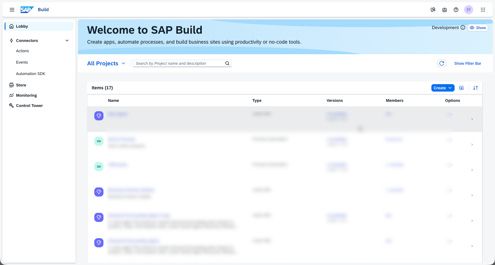

2. Select **Joule Agent and Skill**.

   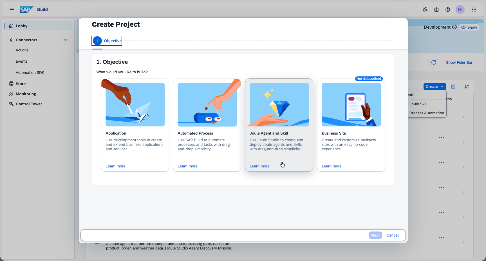

3. Enter a name for the project.

   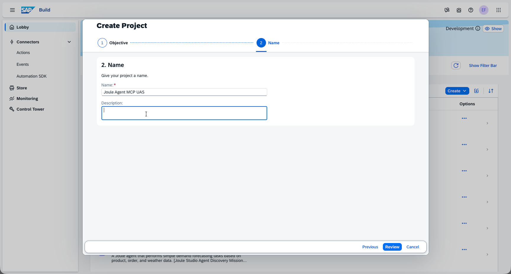

4. Click **Create**.

   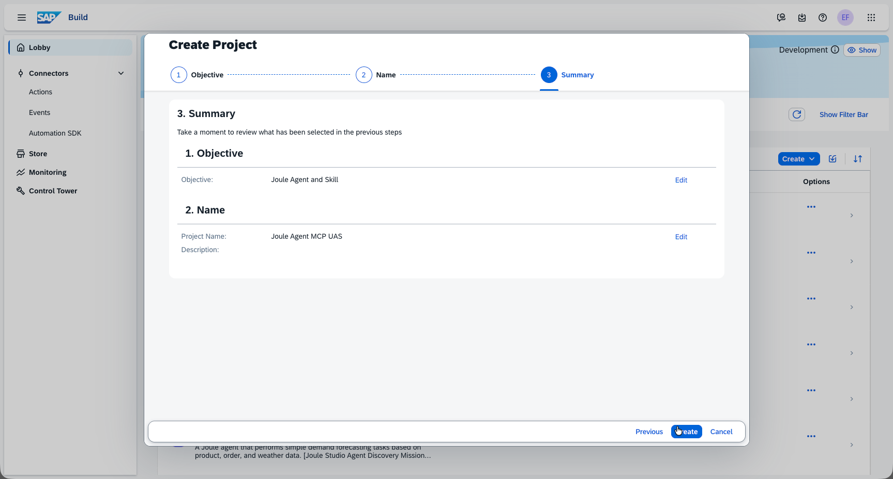

---

### Step 7: Create an Agent Inside the Project

1. Inside the new project, click **Create Agent**.

   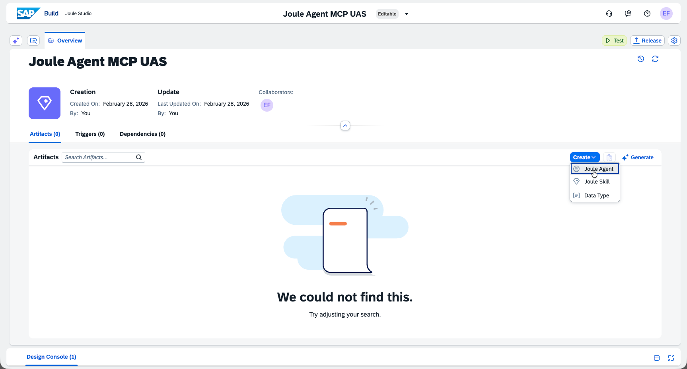

2. Fill in the **Name** and **Description** fields.

   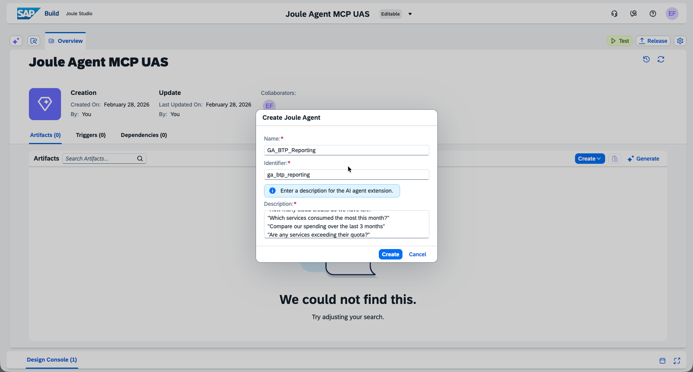

   | Field | Value |
   |-------|-------|
   | **Name** | `GA_BTP_Reporting` |
   | **Description** | An AI-powered assistant that connects to your SAP BTP account to provide real-time insights on cloud consumption. Ask questions like: "How many cloud credits do we have left?", "Which services consumed the most this month?", "Compare our spending over the last 3 months", "Are any services exceeding their quota?" |

3. Fill in the **Expertise** and **Instructions** fields.

   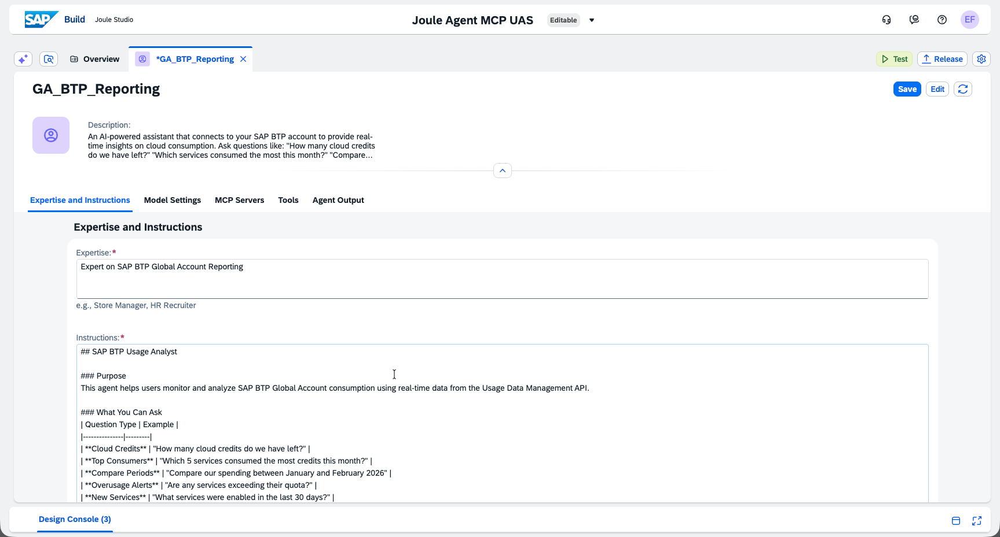

   | Field | Value |
   |-------|-------|
   | **Expertise** | `Expert on SAP BTP Global Account Reporting` |
   | **Instructions** | Copy the full text from the [Agent Instructions](#agent-instructions) section below. |

---

### Step 8: Add the MCP Server to the Agent

1. Click **Add MCP Server**.

   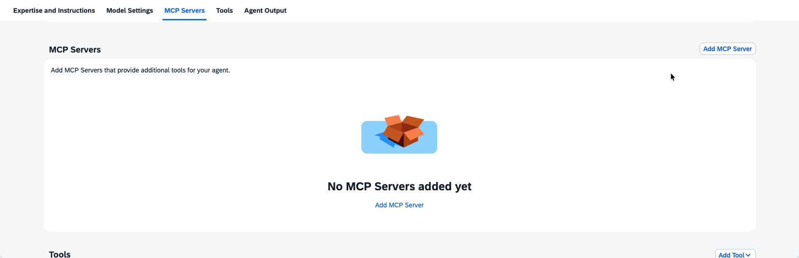

2. Fill in the MCP Server details and select the destination created in Step 3.

   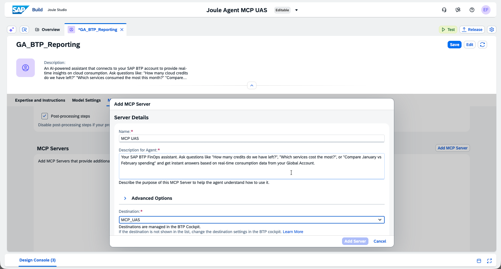

   | Field | Value |
   |-------|-------|
   | **Name** | `MCP_UAS` |
   | **Description for Agent** | Your SAP BTP FinOps assistant. Ask questions like "How many credits do we have left?", "Which services cost the most?", or "Compare January vs February spending" and get instant answers based on real-time consumption data from your Global Account. |
   | **Destination** | Select `MCP_UAS` (created in Step 3) |

3. Click **Add Server**, then **Save**.

   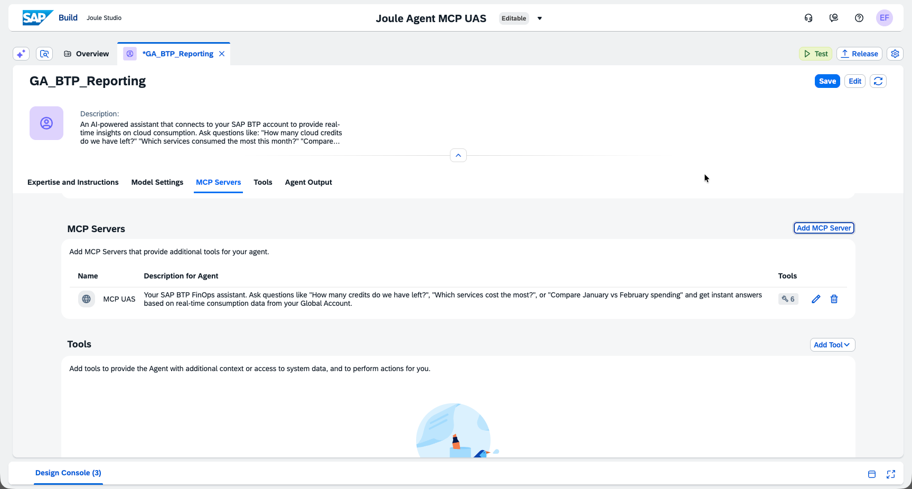

4. Add additional tools to the agent:
   - Click **Add Tool**.
   - Select **Calculator** from the list of available tools.
   - Click **Add** to confirm.

   > This allows the agent to perform calculations when analyzing cost data.

---

### Step 9: Test the Agent

1. Click **Test** to open the test panel.

   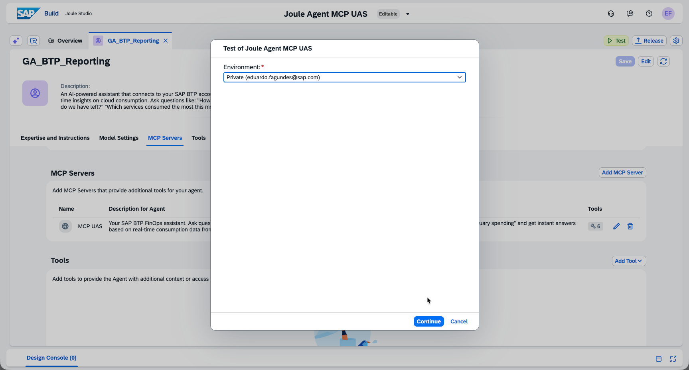

2. Ask your agent a question, for example:

   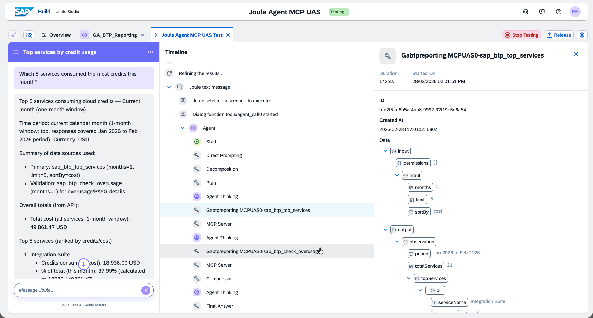

   > *"Which 5 services consumed the most credits this month?"*

✅ Done! Your Joule agent is now connected to the BTP Usage MCP Server.

---

## Agent Instructions

Copy the text below and paste it into the **Instructions** field when configuring the agent (Step 7).

---

### SAP BTP Usage Analyst

#### Purpose
This agent helps users monitor and analyze SAP BTP Global Account consumption using real-time data from the Usage Data Management API.

### Tools
You may use the calculator tool to support your calculations if necessary.

#### What You Can Ask

| Question Type | Example |
|---------------|---------|
| **Cloud Credits** | "How many cloud credits do we have left?" |
| **Top Consumers** | "Which 5 services consumed the most credits this month?" |
| **Compare Periods** | "Compare our spending between January and February 2026" |
| **Overusage Alerts** | "Are any services exceeding their quota?" |
| **New Services** | "What services were enabled in the last 30 days?" |
| **Cost Breakdown** | "Show cost summary by subaccount and datacenter" |

#### Available Tools

| Tool | Description |
|------|-------------|
| `sap_btp_get_cloud_credits` | Check cloud credit balance, phases, and expiry dates |
| `sap_btp_top_services` | List top N services by cost or usage |
| `sap_btp_compare_months` | Compare consumption between two months |
| `sap_btp_check_overusage` | Identify services exceeding quota or incurring PAYG costs |
| `sap_btp_new_services` | List recently enabled services |
| `sap_btp_cost_summary` | Get cost breakdown by service, subaccount, or datacenter |

#### Guidelines
- Always specify the time period when comparing data.
- Use the `top` parameter (default: 5) when listing top consumers.
- For cost breakdowns, specify `groupBy`: `service`, `subaccount`, or `datacenter`.
- All data comes from the SAP BTP Usage Data Management API in real time.

#### Example Interactions

**User:** "How many credits do we have left?"
**Agent:** Calls `sap_btp_get_cloud_credits` → Returns balance, expiry, and phase info.

**User:** "Which services are over budget?"
**Agent:** Calls `sap_btp_check_overusage` → Returns list of services exceeding quota.

**User:** "Compare December vs January spending"
**Agent:** Calls `sap_btp_compare_months` with months `2025-12` and `2026-01` → Returns a comparison table.

---

## Local Development (Optional)

Want to run the server on your machine for testing?

### Step 1: Create `default-env.json`

Copy credentials from your Cloud Foundry services:

```bash
cf service-key sap-btp-usage-xsuaa local-key
cf service-key sap-btp-usage-destination local-key
```

Create `default-env.json` (⚠️ **never commit this file**):

```json
{
  "VCAP_SERVICES": {
    "xsuaa": [{
      "label": "xsuaa",
      "name": "sap-btp-usage-xsuaa",
      "credentials": {
        "clientid": "...",
        "clientsecret": "...",
        "url": "https://..."
      }
    }],
    "destination": [{
      "label": "destination",
      "name": "sap-btp-usage-destination",
      "credentials": {
        "clientid": "...",
        "clientsecret": "...",
        "uri": "...",
        "url": "..."
      }
    }]
  }
}
```

### Step 2: Run Locally

```bash
# With authentication (production-like)
npm run local

# Without authentication (easier for testing)
AUTH_ENABLED=false npm run local
```

Server runs at `http://localhost:3000`

---

## API Endpoints

| Endpoint | What it does |
|----------|--------------|
| `GET /` | Server info |
| `GET /health` | Health check |
| `POST /mcp` | MCP endpoint (protected) |
| `GET /mcp/sse` | SSE transport (protected) |

---

## Troubleshooting

### "Connection refused" or "401 Unauthorized"
- Check if the app is running: `cf apps`
- Verify the destination credentials match the service key

### "Destination not found"
- Make sure `SAP_BTP_USAGE_API` destination exists in BTP Cockpit
- Check the destination name is exact (case-sensitive)

### Joule doesn't see the MCP server
- Verify `sap-joule-studio-mcp-server: true` property is set
- Make sure the destination is in the **same subaccount** as Joule Studio

### Check the logs
```bash
cf logs sap-btp-usage-mcp-server --recent
```

---

## Project Structure

```
sap-btp-usage-mcp-server/
├── src/
│   ├── auth/          # JWT validation & XSUAA
│   ├── schemas/       # Input validation (Zod)
│   ├── services/      # SAP BTP Usage API client
│   ├── tools/         # MCP tool definitions
│   └── index.ts       # Main entry point
├── manifest.yaml      # CF deployment config
├── xs-security.json   # XSUAA scopes & roles
└── package.json
```

---

## Learn More

- [SAP BTP Usage API](https://api.sap.com/api/APIUasReportingService/overview) — API documentation
- [Model Context Protocol](https://modelcontextprotocol.io/) — MCP specification
- [SAP Joule](https://help.sap.com/docs/joule) — AI assistant docs
